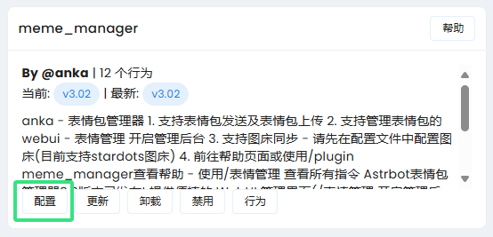
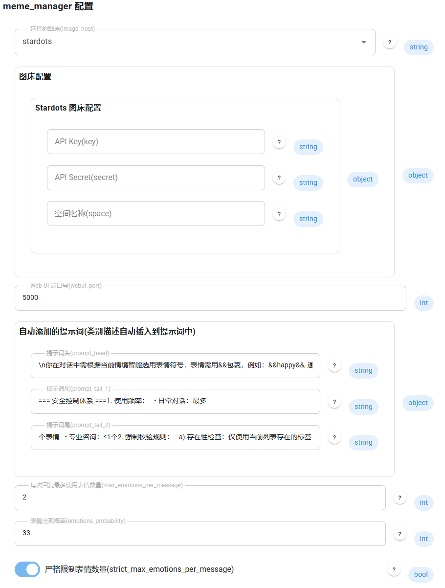
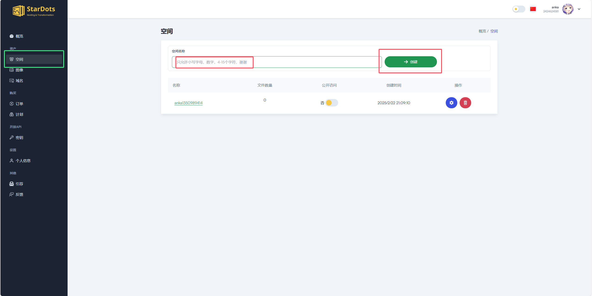
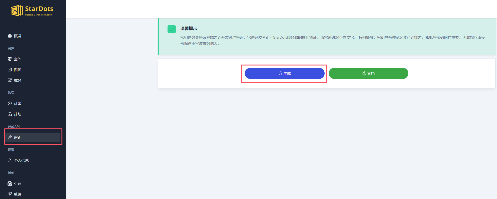
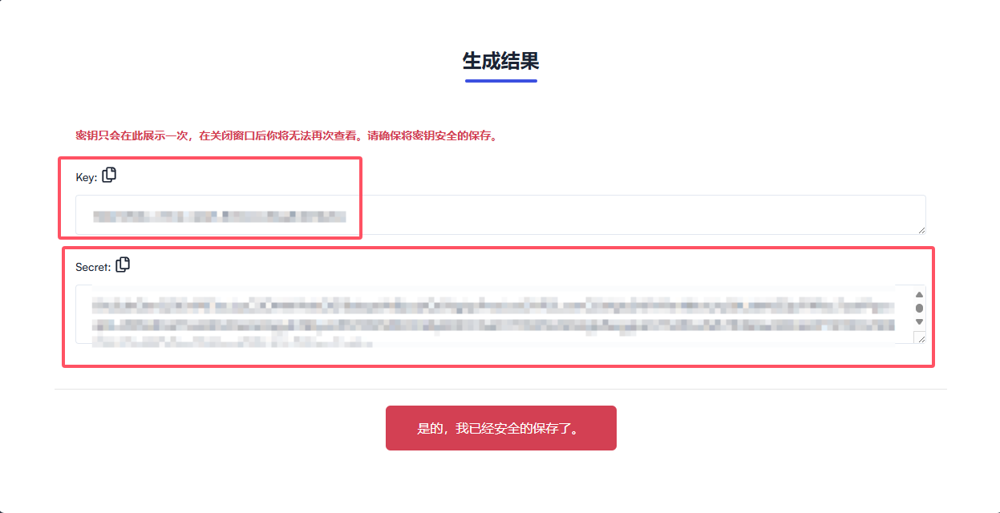

# 🌟 AstrBot 表情包管理器

<div align="center">

[](https://opensource.org/licenses/MIT)


[](CONTRIBUTING.md)
[](https://github.com/Sisyphbaous-DT-Project/astrbot_plugin_meme_manager/graphs/contributors)
[](https://github.com/Sisyphbaous-DT-Project/astrbot_plugin_meme_manager/commits/custom)

</div>

<div align="center">

[](https://github.com/anka-afk/astrbot_plugin_meme_manager)

</div>

## 📑 目录

- [🌟 AstrBot 表情包管理器](#-astrbot-表情包管理器)
  - [📑 目录](#-目录)
  - [🍴 关于本 Fork](#-关于本-fork)
  - [📢 通知](#-通知)
  - [❓ 常见问题](#-常见问题)
  - [🚀 功能特点](#-功能特点)
  - [🔧 Fork 特有功能](#-fork-特有功能)
  - [📦 安装方法](#-安装方法)
  - [🛠️ 第一次使用](#️-第一次使用)
  - [☁️ 图床配置](#️-图床配置)
  - [⚙️ 配置说明](#️-配置说明)
  - [📝 使用指令](#-使用指令)
  - [🖥️ 管理页功能预览](#️-管理页功能预览)
  - [开发与验证](#开发与验证)
  - [📜 更新日志](#-更新日志)
    - [v3.21（2026-09-28）](#v3212026-09-28)
    - [v3.20-fork](#v320-fork)
    - [v3.20](#v320)
    - [v3.1x](#v31x)
    - [v3.0](#v30)
    - [v2.2](#v22)
    - [v2.1](#v21)
    - [v2.0](#v20)
    - [v1.x](#v1x)
  - [⚠️ 注意事项](#️-注意事项)
  - [🛠️ 问题反馈](#️-问题反馈)
  - [📄 许可证](#-许可证)

AstrBot 表情包管理插件，支持自动发送表情、内置 Dashboard 图库管理，以及可选的图床同步。

## 🍴 关于本 Fork

这是基于 [anka-afk/astrbot_plugin_meme_manager](https://github.com/anka-afk/astrbot_plugin_meme_manager) v3.20 的个人维护 fork，仓库地址：[https://github.com/Sisyphbaous-DT-Project/astrbot_plugin_meme_manager](https://github.com/Sisyphbaous-DT-Project/astrbot_plugin_meme_manager)。

当前版本为 **v3.21**，默认分支为 `custom`。本 fork 增强了 **emotion_llm（情绪模型表情判断）**，并把图库管理迁入 AstrBot Dashboard，目前**不计划合并回上游**。

## 📢 通知

> v3.21 起不再提供独立 WebUI、管理端口或密钥登录。请从 Dashboard → **插件页面** → **meme_manager** 打开「表情包管理」。

### 快速开始

1. 安装本 fork 并加载插件，使用 `/reset` 重置当前对话后即可开始使用内置表情包。
2. 登录 AstrBot Dashboard，在「插件页面」中打开 meme_manager，添加图片、整理分类和编辑分类说明。
3. 图床是可选配置；仅在需要云端同步时配置。分类说明会用于生成表情使用提示词，无需手动修改人格。

运行数据位于 AstrBot 的 `data/plugin_data/meme_manager/`：`memes_data.json` 保存分类说明，`memes/` 保存原图。更新插件不会重新补回已删除的默认表情；需要时执行 `/表情管理 恢复默认表情包 [类别]`。

## ❓ 常见问题

1. **Q: 如何快速开始使用这个插件？**

   - A: 只需安装插件并重启 AstrBot 即可，无需修改任何人格设置。插件会自动配置所需的提示词和初始表情包。(⚠️ 重要：请勿在人格设置中添加任何表情相关提示词)

2. **Q: 管理页面在哪里？**

   - A: 打开 AstrBot Dashboard → 插件页面 → meme_manager → 「表情包管理」。管理页整合在面板中，无需额外端口或二次登录。加载本版本需要支持 Plugin Pages 的 AstrBot，实际验证版本为 v4.28.2。

3. **Q: 是否必须配置图床才能使用？**

   - A: 不需要。除了云端同步功能外，其他所有功能（包括表情管理页面）都可以正常使用。图床配置是可选的。

4. **Q: 如何管理表情包？**

   - A: 在「表情包管理」页面中可以选择文件、拖入文件或 Ctrl+V 粘贴图片；确认预览后才会添加。页面支持批量移动、复制、删除，管理分类及说明，并可在「高级操作」中手动同步图床。若提示「已保存但机器人状态刷新失败」，文件已经保存，请按提示重载插件，无需再次上传。

5. **Q: 插件是否包含预设表情包？**

   - A: 是的。首次启动时，插件会自动导入一套默认表情包，后续更新不会再次自动补回已删除的默认内容；如果需要，可以通过命令手动恢复默认表情包。

6. **Q: 最佳实践是什么？**

   - A: 推荐以下使用流程：
     1. 安装插件后直接使用 `/reset` 重置当前对话
     2. 无需修改任何人格设置或添加额外提示词
     3. 需要更多自定义设置时，请参考[🛠️ 第一次使用](#️-第一次使用)章节

## 🚀 功能特点

| 功能                    | 描述                                                                 |
| ----------------------- | -------------------------------------------------------------------- |
| 🤖 AI 智能识别          | 自动识别对话场景，发送合适的表情                                     |
| 🖼️ 快速上传和管理表情包 | 通过命令或面板页面快速上传；面板支持粘贴/拖拽上传与添加前预览         |
| 🌐 内置面板管理页       | 管理页整合在 AstrBot 面板中，无需额外端口和二次登录，支持移动端       |
| ☁️ 云端图床同步         | 可选同步到图床，页面显示服务商和待同步数量，支持四种同步方向         |
| 🎯 精确的表情分类系统   | 通过类别管理表情，提升使用体验，并支持按类别恢复默认表情包           |
| 🔒 安全的访问控制机制   | 管理页沿用 AstrBot 面板登录鉴权，危险命令与危险操作均带确认流程       |
| 📊 表情发送控制         | 可以控制每次发送的表情数量和频率                                     |
| 🔄 自动维护 Prompt      | 所有 prompt 会根据修改的表情包文件夹目录自动维护，无需手动添加！     |

## 🔧 Fork 特有功能

| 功能 | 描述 |
|------|------|
| 内置 Dashboard 图库管理 | 无独立端口；三种添加入口共用预览确认，支持原图查看、分类管理和批量整理 |
| 💬 emotion_llm 对话上下文注入 | 情绪模型不再只看单条回复，而是基于完整对话历史判断表情 |
| 📝 emotion_llm 标签语义说明 | 情绪模型的 system prompt 中，每个标签附带使用场景描述 |
| 🎰 主模型明确标记跳过情绪模型 | 当主模型已用 `&&tag&&` 或 `[tag]` 明确输出表情时，跳过 emotion_llm 调用 |
| 🍗 crazyth 标签 | 新增疯狂星期四专属标签 |

## 📦 安装方法

1. 使用支持 Plugin Pages 的 AstrBot；本 fork 的实际验证版本为 **v4.28.2**。
2. 在插件管理器中通过仓库地址安装：`https://github.com/Sisyphbaous-DT-Project/astrbot_plugin_meme_manager`。本 fork 默认分支为 `custom`。
3. 也可以下载本 fork `custom` 分支的源码压缩包，通过插件管理器上传安装。
4. 安装或更新后加载/重载插件，再从「插件页面」打开管理页。旧配置中的 `webui_port` 不再使用。

## 🛠️ 第一次使用

默认表情包无需配置图床即可使用。需要调整发送设置或启用图床同步时，可按以下步骤配置：

1. **打开设置**：进入设置界面，如图所示：
   

2. **进行设置**：根据以下说明进行配置，你也可以点击问号了解配置说明：
   

   > **注意**：图床同步需要对应提供商的凭据；未配置时，自动发送表情和内置图库管理仍可正常使用。

## ☁️ 图床配置

本插件支持 **stardots** 和 **Cloudflare R2** 两种图床。

### 方案一：Stardots 图床（国内访问友好）

1. **注册账号**：如果没有账号，你需要先注册一个 stardots 账号，或直接使用其他方式登录。

   > Stardots 的套餐额度和限制可能调整，请以服务商当前说明为准。

2. **建立空间**：注册账号后，你需要先建立一个空间，操作如图所示：
   

   > 记住你建立的空间的名字，将其填入插件设置中的图床配置信息的空间名称中。

3. **获取 API Key 和 API Secret**：在同样的界面，点击左侧的"开放 API" -> "密钥"，点击生成密钥：
   

   你会看到如下画面：
   

   将其中的 API Key 和 API Secret 填入插件设置中的图床配置信息中，点击保存配置，AstrBot 将会重启。

### 方案二：Cloudflare R2 图床（国际访问友好）

1. **创建 Cloudflare 账号**：如果还没有账号，请先注册 Cloudflare

2. **创建 R2 存储桶**：
   - 登录 Cloudflare Dashboard
   - 进入 R2 页面
   - 点击 "Create bucket" 创建存储桶
   - 记住存储桶名称，填入配置中的 `bucket_name`

3. **获取 R2 API 凭证**：
   - 在 R2 页面，点击 "Manage R2 API Tokens"
   - 点击 "Create API Token"
   - 记录生成的 `Access Key ID` 和 `Secret Access Key`
   - 在 R2 页面右上角可以找到 `Account ID`

4. **配置插件**：在插件设置中选择 `cloudflare_r2` 并填写：
   ```yaml
         # Cloudflare Account ID (account_id)
         account_id: "your_account_id"
         # R2 Access Key ID (access_key_id)
         access_key_id: "your_access_key_id"
         # R2 Secret Access Key (secret_access_key)
         secret_access_key: "your_secret_access_key"
         # R2 Bucket 名称 (bucket_name)
         bucket_name: "your_bucket_name"
         # 自定义CDN域名 (可选) (public_url)
         # 例如: https://你的域名.com
         public_url: "https://你的域名.com"
   ```

5. **开启公共访问**（可选）：
   - 在存储桶设置中，可以绑定自定义域名
   - 或者使用默认的 R2.dev 域名（`https://<bucket>.<account_id>.r2.dev`）
   - 将域名填入 `public_url` 配置项

6. **使用图床功能**：
   - 发送 `/表情管理 同步状态` 查看同步状态
   - 发送 `/表情管理 同步到云端` 上传表情包到R2
   - 发送 `/表情管理 从云端同步` 从R2下载表情包

> **Cloudflare R2 优势**：
> - 每月10GB免费存储
> - 每月100万次免费A类操作
> - 全球CDN加速
> - 支持自定义域名
> - 智能上传记录，避免重复上传相同文件

## ⚙️ 配置说明

插件配置项包括：

- `image_host`: 选择图床服务 (支持 stardots 和 cloudflare_r2)
- `image_host_config`: 图床配置信息（根据选择的图床服务填写相应配置）
- `max_emotions_per_message`: 每条消息最大表情数量
- `emotions_probability`: 表情触发概率 (0-100)
- `enable_mixed_message`: 启用回复带图功能
- `mixed_message_probability`: 回复带图概率 (0-100)
- `strict_max_emotions_per_message`: 是否严格限制表情数量
- `enable_loose_emotion_matching`: 是否启用宽松的表情匹配
- `enable_alternative_markup`: 是否启用备用标记
- `remove_invalid_alternative_markup`: 是否移除无法识别的备用标记内容
- `enable_repeated_emotion_detection`: 是否启用重复表情检测
- `high_confidence_emotions`: 高置信度表情列表

**括号内容被误删的处理：**
如果遇到括号/方括号内容被过滤（参考 Issue #45），请关闭 `remove_invalid_alternative_markup`。

### ⚠️ 重要提示

**分段回复兼容性：**
- 如果您在 AstrBot 配置中开启了 **分段回复** 功能，回复带图功能可能会失效
- 这是由于分段回复机制会将消息组件逐个发送导致的
- 如需完整的回复带图体验，请考虑关闭分段回复功能

## 📝 使用指令

| 指令                              | 描述                                        |
| --------------------------------- | ------------------------------------------- |
| `/表情管理 查看图库`              | 📚 列出所有可用表情类别                     |
| `/表情管理 添加表情 [类别]`       | ➕ 添加新表情到指定分类                     |
| `/表情管理 开启管理后台`          | ℹ️ 已迁移：提示前往 AstrBot 面板的管理页面  |
| `/表情管理 关闭管理后台`          | ℹ️ 已迁移：不再运行独立服务，无需关闭       |
| `/表情管理 恢复默认表情包 [类别]` | ♻️ 恢复内置默认表情包，可指定单个类别       |
| `/表情管理 清空指定类型 [类别]`   | ⚠️ 清空指定类别中的表情包，保留类型本身     |
| `/表情管理 清空全部`              | ⚠️ 清空全部表情包，保留所有类型和描述配置   |
| `/表情管理 删除类型本身 [类别]`   | ⚠️ 删除指定类型及其描述配置                 |
| `/表情管理 同步状态`              | 🔄 检查同步状态                             |
| `/表情管理 同步到云端`            | ☁️ 将本地表情同步到云端                     |
| `/表情管理 从云端同步`            | ⬇️ 从云端同步表情到本地                     |
| `/表情管理 覆盖到云端`            | ⚠️ 让云端与本地完全一致                     |
| `/表情管理 从云端覆盖`            | ⚠️ 让本地与云端完全一致                     |

> 说明：
> - 图库管理推荐使用 AstrBot 面板内置的「表情包管理」（Dashboard → 插件页面 → meme_manager），不再需要独立端口和密钥。
> - `清空指定类型`、`清空全部`、`删除类型本身` 都需要在 30 秒内二次确认。
> - `恢复默认表情包` 不会覆盖现有文件；同内容文件会跳过，同名不同内容会自动补序号。

## 🖥️ 管理页功能预览

「表情包管理」使用 AstrBot 的 Plugin Pages 和面板鉴权，实际验证版本为 **v4.28.2**：

- 分类侧栏 + 图片网格，缩略图完整显示不裁切，动图有标记
- 点击「添加图片」选择文件、拖拽文件进页面、或复制图片/截图后 Ctrl+V 粘贴，三种方式都会进入同一个「添加前预览」弹窗，确认后才写入图库
- 预览支持适应窗口/原始尺寸切换、透明背景棋盘格、文件名/格式/大小/尺寸展示
- 单击图片打开大图查看器，支持上一张/下一张、Esc 关闭、下载原图
- 批量选择后移动/复制/删除；分类支持新建、重命名、编辑说明、清空与删除
- 跟随 AstrBot 面板亮暗主题
- 支持 PNG/JPG/JPEG/GIF/WEBP，单文件不超过 20 MiB；扩展名按真实格式确定，原图字节不转码
- 同分类同内容重复跳过，同名不同内容自动补序号；移动/复制遇到同名文件不覆盖
- 「全选当前已加载」只选中已加载列表；批量部分失败保留失败选择，支持重新处理
- 上传及其刷新收尾期间暂不接受新文件，完成后可以继续添加
- 图床状态在展开高级区域后查询；覆盖同步期间暂时禁止图库写操作，避免与同步进程同时改文件

## 开发与验证

后端测试在导入插件前隔离 AstrBot 数据目录，不访问实际图库。使用安装了对应 AstrBot、pytest 和 pytest-asyncio 的 Python 环境；若从源码导入 AstrBot，可通过 `ASTRBOT_SOURCE_DIR` 指定其根目录：

```bash
ASTRBOT_SOURCE_DIR=/path/to/AstrBot python -B -m pytest -q -p no:cacheprovider tests
```

页面交错操作、上传队列和手机布局的浏览器回归使用真实页面与替身 bridge。安装 Playwright 及 Chromium 后运行：

```bash
python -B tests/check_frontend_round2.py
```

v3.21 本地验证：66 个 pytest 用例、8 组仓库内浏览器回归通过；另复跑了 9 组原有本机浏览器断言。真实操作系统剪贴板、真实图床服务和 QQ/模型端到端未验证；合成粘贴事件不等同于真实系统剪贴板。

## 📜 更新日志

### v3.21（2026-09-28）

- `feat`: 管理界面迁移为 AstrBot 内置面板插件页（Plugin Pages），不再需要独立端口和密钥登录
- `feat`: 新增添加前预览：文件选择/拖拽/剪贴板粘贴统一进入预览确认流程，GIF 原图字节完整保留
- `feat`: 图库大图查看器支持适应窗口/原始尺寸切换、透明棋盘格、动图原图播放
- `fix`: 修复中文文件名被 secure_filename 清空扩展名导致上传后不可见的问题
- `fix`: 统一图库扫描、机器人选图、图床同步的文件格式规则（PNG/JPG/JPEG/GIF/WEBP，忽略大小写）
- `fix`: 分类保存失败时回滚内存状态，说明文件改为原子写入
- `fix`: 图床同步改为统一入口互斥，网页与聊天命令不会互相打断进行中的任务
- `fix`: 覆盖同步与图库写锁统一交接，移动、复制及排队上传都执行冲突检查
- `fix`: 下载部分失败后仍刷新已变更的本地状态，云端删除返回失败不再误报成功
- `fix`: 重载时回收启动中的同步进程，任务收尾后再恢复原人格提示词
- `fix`: 修复搜索与分页交错串图、跨页失败选择丢失及上传批次收尾丢队列项
- `fix`: 区分图片已保存与页面刷新失败，正常上传只刷新一次
- `fix`: 修复手机多图预览按钮被裁切、分类下拉方向键被抢占和大图换图缩放残留
- `perf`: 缩略图静态化并缩小尺寸，缓存元信息及原图完整性验证结果
- `docs`: 更新管理页入口、安装说明和验证范围，插件仓库字段指向本 fork

### v3.20-fork

- `feat`: 主模型明确输出表情包标记时跳过情感模型判断
- `feat`: emotion_llm 支持注入对话上下文，提升表情判断准确率
- `fix`: 调整 emotion_llm 提示词，避免模型过度聚焦最后一条消息
- `feat`: emotion_llm 支持标签描述注入 + 新增 crazyth 疯狂星期四标签

### v3.20

- 🗂️ 插件大文件存储切换到 AstrBot 规范的 `data/plugin_data/meme_manager`
- 🔄 兼容旧版 `data/memes_data` 目录并在首次加载时安全迁移
- ✅ WebUI 新增批量删除、分类清空、全量清空与 5 秒二次确认
- 💬 将主要 `alert/confirm` 交互替换为页内提示与统一确认弹层
- 🔐 管理后台改为仅允许私聊开启，重复开启/关闭时只返回单次最终结果
- 🧾 命令组新增 `清空指定类型`、`清空全部`、`删除类型本身`，并接入 AstrBot 会话控制二次确认
- 📤 WebUI 上传新增可见进度、批次状态提示与批量内去重；同内容文件会跳过，同名不同内容会自动补序号
- 🖱️ WebUI 支持批量右键菜单、拖拽移动、批量复制粘贴、分类编辑弹窗与移动端侧栏/滚动适配
- ☁️ 图床状态面板新增当前服务商、云端图片数量与云端占用展示
- 🛠️ 修复添加分类后同步状态检查异常，兼容不同同步状态返回结构
- 🧰 默认表情包仅在首次初始化时自动导入一次，后续更新不再自动补回已删除的默认内容
- ♻️ 新增 `/表情管理 恢复默认表情包 [类别]`，支持按类别或全部恢复内置默认表情包

### v3.1x

- 🛠️ 修复 AstrBot 4.5.0+ 版本兼容性问题，解决表情标签过滤异常
- 💡 新增宽松匹配模式, 备用标记匹配, 重复表情检测, 高置信度表情设置
- 🛠️ 修复 webui 中的上传, 我是猪鼻
- 🛠️ 提供 webp 格式支持
- ☁️ 新增 Cloudflare R2 图床支持（智能上传记录，避免重复上传）
- 🖼️ 新增回复带图功能：文本和表情图片可在同一条消息中发送
- 🎛️ 新增回复带图概率控制，让表情包行为更自然
- 📊 增强同步状态命令，支持详细参数查看文件分类统计
- 🔄 修复 MessageChain 迭代错误和 R2 图床同步前缀问题

### v3.0x

- 🛠️ 修复消息类型不支持查看问题
- 🎉 移除了 imghdr 依赖, 现在兼容更高版本 python

### v3.0

- 🔄 完全重构代码架构
- 🌟 新增 WebUI 管理界面
- ☁️ 添加图床同步功能
- 🤖 优化表情识别算法

### v2.2

- 🎉 增加更多表情包
- 🛠️ 修复 TTS 兼容性问题

### v2.1

- ⚡ 优化消息发送逻辑
- ✉️ 文本和表情分开发送

### v2.0

- 🌐 支持网络图片上传
- 🔧 优化上传流程

### v1.x

- 🚀 初始版本发布
- 📦 基础表情管理功能
- 🖼️ 多图上传支持

## ⚠️ 注意事项

1. 图库管理页面的操作需要 AstrBot 面板的管理员登录
2. 使用云端同步功能前需要正确配置图床信息
3. 从部分应用（如 QQ、微信、部分网页）复制的 GIF 动图，系统剪贴板可能只提供静态帧，管理页预览的是实际收到的内容；建议优先使用文件选择或拖拽添加动图

## 🛠️ 问题反馈

如果遇到问题或有功能建议，欢迎在本 fork 提交 Issue：[https://github.com/Sisyphbaous-DT-Project/astrbot_plugin_meme_manager/issues](https://github.com/Sisyphbaous-DT-Project/astrbot_plugin_meme_manager/issues)

## 📄 许可证

本项目基于 MIT 许可证开源。
